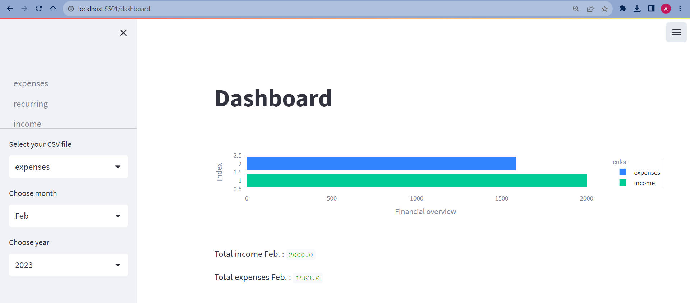
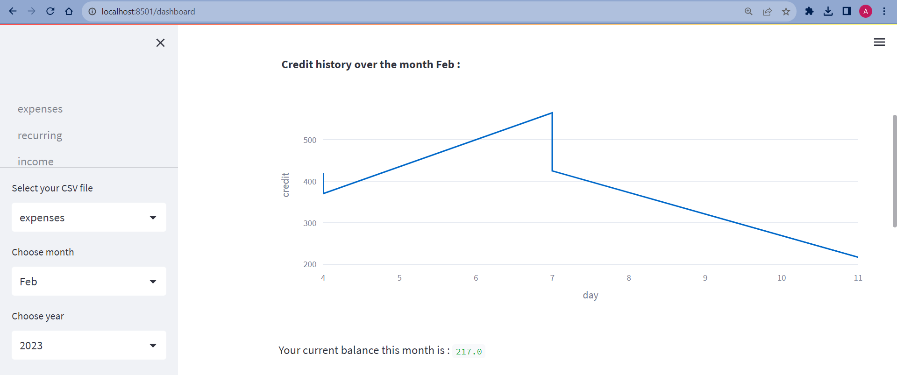
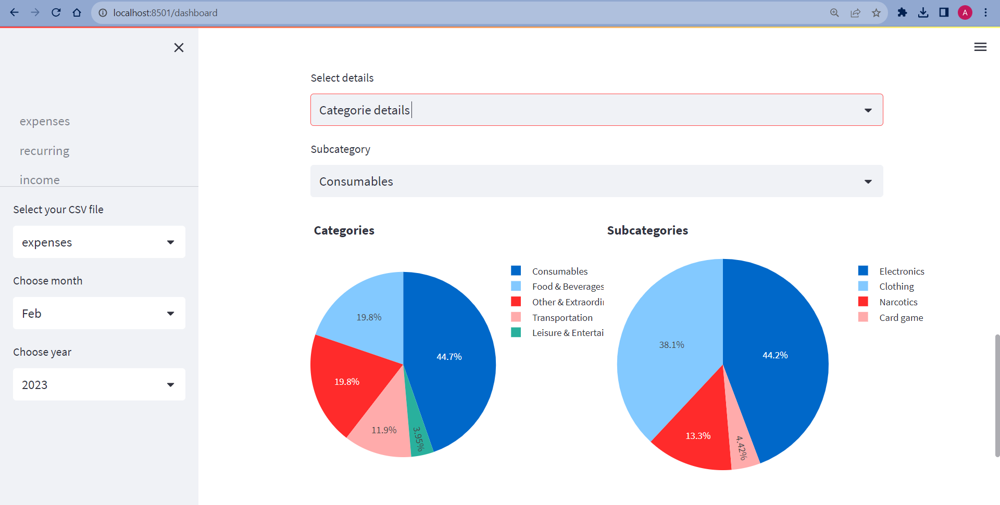

# Financial tracker
A financial tool to analyse and visualize expenses.

🔗 [Link to GitHub repository](https://github.com/adhamarif/ImageRecommender)

## Libraries used

| **Library** | **Description** |
| ---------- | --------------------------------------------------------------------------------------------------------------------------- |
| Streamlit   | A Python based GUI for creating simple GUI   |
| Pandas     | Data processing and analysis |
| Plotly      | Data Visualization |

## Process

* A GUI is created by using **Streamlit** that user can add or remove their expense and income information.
* The information is then saved in **Pandas** dataframe and .csv file as backup.
* The expenses and income are then further analyze and visualize by interatictive visualization library such as **Plotly**.

## Results

*Cashflow overview*

*Credit history overview*

*Expense by category*

## Conclusion

* Learn how to use **GitHub** for Continuous Integration and a tool for version control and collaboration.
* Implementation of GUI in Python project
